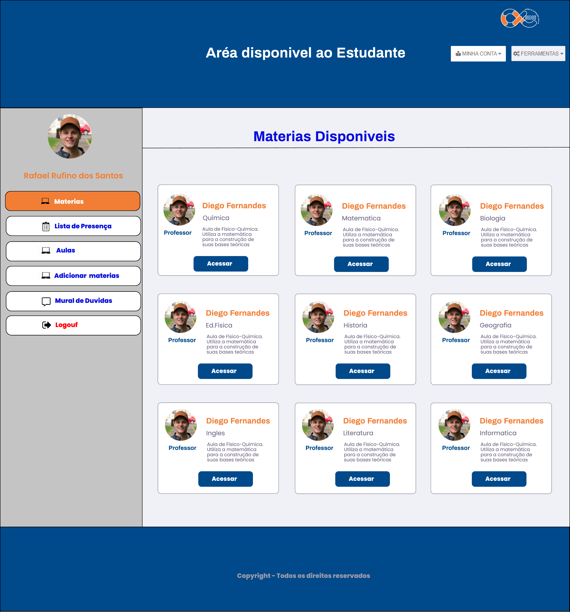
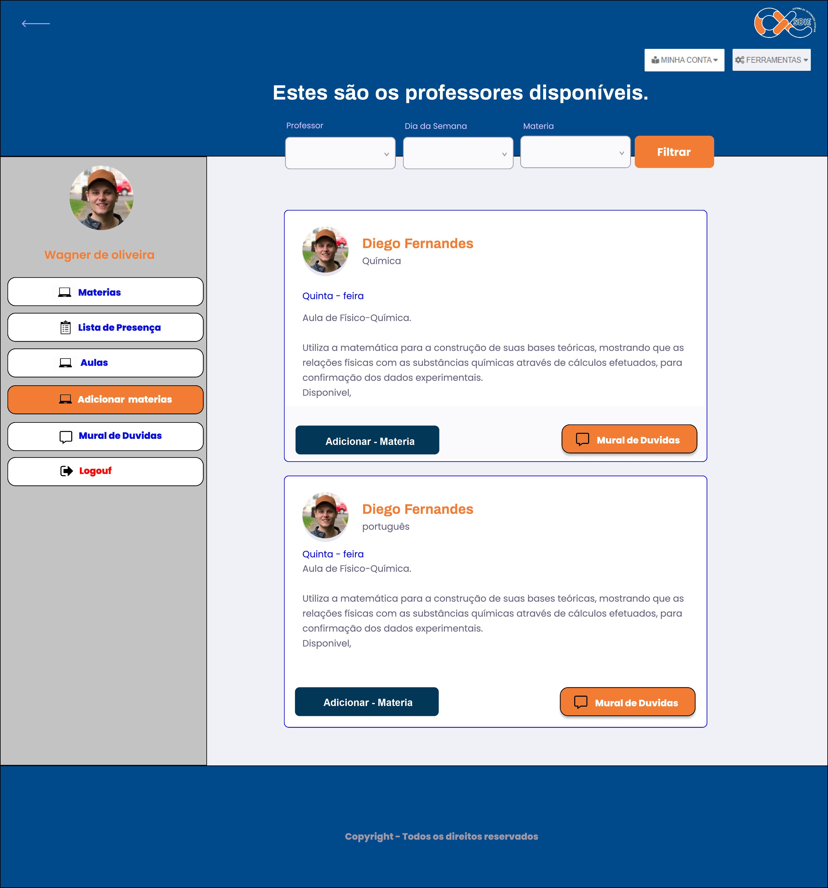
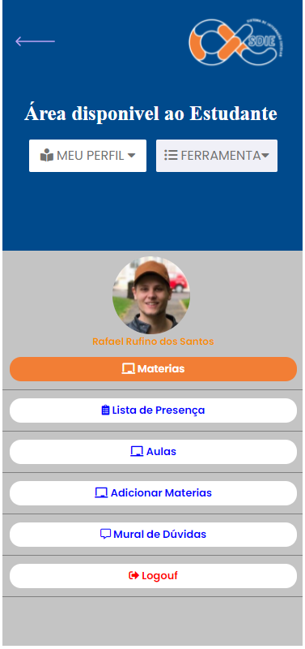

<h3 align="center">
    
    <br><br>
    <b>Plataforma Desenvolvida para auxiliar professores e alunos da rede pública!</b>  
    <br>
</h3>


<!-- <p align="center">
  <a href="https://github.com/Rafael-Rufino/Sistema-de-Intergra-o-Escolar/">
    
  </a>
  <a>
</p> -->


# Índice

- [Sobre](#sobre)
- [Documentação](#documentacao)
- [Tecnologias Utilizadas](#tecnologias-utilizadas)
- [Como Usar](#como-usar)
- [Como Contribuir](#como-contribuir)

<a id="sobre"></a>

## :bookmark: Sobre

O <strong>SDIE</strong> é uma aplicação Web voltado para promover o ensino a distância em Escolas públicas.  
<br/>
Essa aplicação foi construída para integrar professores e alunos da rede pública, permitindo o estudo extraclasse de forma a remota <strong>Sistema de Intergração Escolar</strong> é um plataforma que auxilia no compartilhamento de conteúdo de forma integrada, e que facilite essa conexão extraclasse.  
<br/>
A ideia de criar uma aplicação voltada para escolas da rede pública, surgiu da necessidade de promover o ensino de forma a distancia devido a <strong>Crise mundial do coronavírus</strong> que afetou todo o sistema de ensino público.

<a id="documentacao"></a>

## :books: Documentação

Para reforçar alguns conceitos e registrar comandos que são dificeis de se lembrar eu fiz uma pequena **[DOCUMENTAÇÃO](DOCUMENTATION.md)** para ajudar quem esta iniciando com **Javascript**, **Node**, **Sqlite**.

<a id="tecnologias-utilizadas"></a>

## :rocket: Tecnologias Utilizadas

O projeto foi desenvolvido utilizando as seguintes tecnologias

- [Html](https://developer.mozilla.org/pt-BR/docs/Aprender/HTML/Introducao_ao_HTML)
- [JavaScript](https://developer.mozilla.org/pt-BR/docs/Web/JavaScript)
- [Node.js](https://nodejs.org/en/)
- [Sqlite](https://sqlite.org/docs.html)

## :heavy_check_mark: :computer: Prototipo da Aplicação

- O layout está disponível no **[Figma](https://www.figma.com/file/XN5gMbp4UIsWUbN88R24JM/SDIE-(SISTEMA-DE-INTEGRA%C3%87%C3%83O-ESCOLAR)?node-id=186883%3A449)**;


## :heavy_check_mark: :computer: Resultado Web

<h1 align="center">
    
    
    
    
</h1>

## :heavy_check_mark: :computer: Video da Aplicação Web

<h1 align="center">
    
</h1>


## :heavy_check_mark: :iphone: Versão Mobile
<h1 align="center">
    
    
    
    
</h1>

## :heavy_check_mark: :iphone: Video da Versão Mobile

<h1 align="center">
    
</h1>


<a id="como-usar"></a>

## :fire: Como usar

- ### **Pré-requisitos**

  - É **necessário** possuir o **[Node.js](https://nodejs.org/en/)** instalado na máquina
  - Também, é **preciso** ter um gerenciador de pacotes seja o **[NPM](https://www.npmjs.com/)** ou **[Yarn](https://yarnpkg.com/)**.
  - Por fim, é **essencial** ter o **[Expo](https://expo.io/)** 
  instalado de forma global na máquina

1. Faça um clone :

```sh
  $ git clone https://github.com/Rafael-Rufino/SDIE---Projeto-tcc-ifrn-ead.git
```

2. Executando a Aplicação:

```sh
  # Instale as dependências
  $ npm int -y 

  ## Crie o banco de dados
  $ cd server
  $ npm run knex:migrate
  $ npm run knex:seed


  # Inicie a aplicação web
  $ cd PROJETO_SDIE/src
  $ npm start

```

<a id="como-contribuir"></a>

## :recycle: Como contribuir

- Faça um Fork desse repositório,
- Crie uma branch com a sua feature: `git checkout -b my-feature`
- Commit suas mudanças: `git commit -m 'feat: My new feature'`
- Push a sua branch: `git push origin my-feature`


## :memo: License

Esse projeto está sob a licença MIT. Veja o arquivo [LICENSE](LICENSE.md) para mais detalhes.

---

<h4 align="center">
    Feito com 💜 by <a href="https://www.linkedin.com/in/rafael-r-dos-santos-b889311ba/" target="_blank">Rafael Rufino</a>
</h4>
